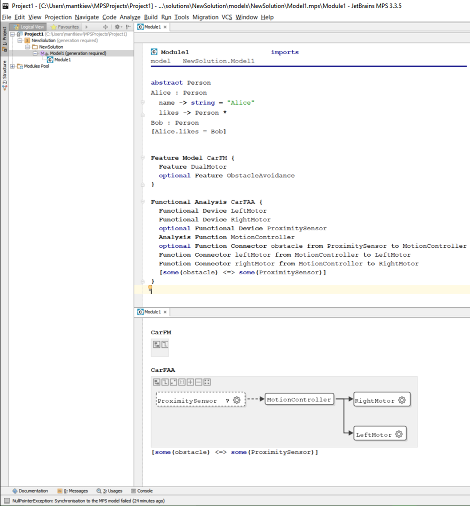

claferMPS
=========

##### v0.4.4

JetBrains Meta-Programming System (MPS) support for Clafer and architectural modeling.

[Clafer](http://clafer.org) is a general-purpose lightweight structural modeling language developed by
[GSD Lab](http://gsd.uwaterloo.ca/), [University of Waterloo](http://uwaterloo.ca), and
[MODELS](http://www.itu.dk/research/models/) group at [IT University of Copenhagen](http://www.itu.dk/).
Clafer can be used for modeling of static hierarchical structures but it has no support for modeling the change of the structures over time (behavior).
The main goal of Clafer is to make modeling more accessible to a wider range of users and domains.

Contributors
------------

* [Eldar Khalilov](http://gsd.uwaterloo.ca/ekhalilov), main developer.
* [Markus Voelter](http://voelter.de/), main developer.
* [Jordan Ross](http://gsd.uwaterloo.ca/j25ross), case studies, requirements, testing.
* [Michał Antkiewicz](http://gsd.uwaterloo.ca/mantkiew), requirements, testing, releases.
* [Krzysztof Czarnecki](http://gsd.uwaterloo.ca/kczarnec), requirements, design of the Architecture DSL.

Features
--------

ClaferMPS consists of three languages: Clafer, Architecture DSL, and milestones. Architecture DSL extends Clafer with automotive concepts from a reference model for early architecture exploration used in [case studies by Jordan Ross](http://gsd.uwaterloo.ca/node/668) (models from these case studies are available for download). The milestones language is useful for tagging model elements with milestones and viewing versions of the model across ranges of milestones.

* Clafer 0.4.4
   * a smart structured editor with autocompletion and many intentions,
   * type system,
   * module system,
   * generator of plain-text Clafer.
* Architecture DSL
   * based on a reference model which is an adaptation of EAST-ADL, including technical feature model, functional analysis architecture, hardware design architecture, and separate functional to hardware architecture deployment specification (details in [technical report](http://gsd.uwaterloo.ca/publications/view/667)),
   * separate definition of quality attributes,
   * editable textual and graphical projections,
   * semantic error checking according to the reference model,
   * generation of plain Clafer separate for every module with and without the quality attributes.

Planned Features
----------------

* integration of the backend reasoners and display of the results as textual or graphical models

Installation
------------

### mbeddr IDE

On Windows and Mac, mbeddr IDE can be installed using an installer. For Linux, see the next section "MPS + mbeddr plugins".
We tested with pre-release [nightly-131](https://github.com/mbeddr/mbeddr.core/releases/tag/nightly-131).

1. Download and install `mbeddr-win-setup.exe` for Windows or `mbeddr-macos.dmg` for Mac from [mbeddr releases](https://github.com/mbeddr/mbeddr.core/releases).
    * no need to install the third-party components
2. Depending on whether you want to install released or development versions
    * for a released version, download ClaferMPS `0.4.4.zip` or `0.4.4.tar.gz` from [ClaferMPS releases](https://github.com/gsdlab/claferMPS/releases) and unpack to some `<target directory>`.
    * for a development version, in some `<target directory>`, clone the GitHub repository using the command
        * `git clone https://github.com/gsdlab/claferMPS.git -b develop`
3. Run mbeddr IDE
    * allow network access through the firewall
    * ignore all issues related to version control (VCS) and Git
4. in mbeddr, without having any project open, click on `Settings`
    * in the search window, type `Global` and open the `Global Libraries` section
    * press `+` to add a new global library `clafer` and give it a value `<targed directory>/claferMPS`

#### Building ClaferMPS

We first need to build `org.clafer.util`.

* NOTE: if there during the build you get an error `cannot save files` run mbeddr in priviledged mode (on Windows, `Run as Administrator`)
* NOTE: in case of severe problems click on `File->Invalidate Caches / Restart`, and select `Invalidate and Restart`

5. `Open Project`
    * choose `<target directory>/claferMPS/org.clafer.util`
    * if mbeddr asks to perform migration, it is usually safe to do so
    * open `Logical project view` using `<alt>+1`
6. In the `Logical View`
    * NOTE: do not build the sandboxes because they depend on Clafer and Architecture DSL which we haven't built yet
    * in `org.clafer.util/milestone` select `org.clafer.util.milestone` and in `org.clafer.util/tags` select `org.clafer.util.tags` and execute `Rebuild Selected Modules` from the context menu (you can select multiple elements using `<ctrl>+<click>`)

Now we can build `org.clafer.mps`.

7. `Open Project`
    * choose `<target directory>/claferMPS/code/languages/org.clafer.mps` and press `This Window`
    * if mbeddr asks to perform migration, it is usually safe to do so
    * open `Logical project view` using `<alt>+1`
8. In the `Logical View`
    * in `org.clafer.mps` select `_spreferences`, `architecture`, `core`, `referenceModel` and execute `Rebuild Selected Modules` from the context menu (you can select multiple elements using `<ctrl>+<click>`)
    * if there's one error (in `_spreferences`), ignore it by pressing `Ignore Errors`

### MPS + mbeddr plugins

This method works on all platforms supported by MPS, including Linux.

1. Download and install [JetBrains Meta Programming System (MPS)](https://www.jetbrains.com/mps/download/) v3.3.5 (build 143.1301) to some `<MPS directory>`.
    * On Windows, install MPS to a location without spaces, e.g., `c:\Programs\MPS3.3`
    * *Important*, start and close MPS before proceeding to step 2.
2. Download `com.mbeddr.allInOne.zip` [mbeddr releases](https://github.com/mbeddr/mbeddr.core/releases) and unpack the contents to `<MPS directory>` (the folder `plugins` from the archive must be merged with the folder `<MPS directory>/plugins`).
3. Run MPS
4. Resume [Building ClaferMPS](#building-clafermps) from the previous section.

### MPS + building mbeddr from source

This method is suitable when working with the latest development versions of mbeddr (on branch `master` and ClaferMPS on branch `develop`).

1. Download and install [JetBrains Meta Programming System (MPS)](https://www.jetbrains.com/mps/download/) v3.3.5 (build 143.1301).
    * On Windows, install MPS to a location without spaces, e.g., `c:\Programs\MPS3.3`
    * *Important*, start and close MPS before proceeding to step 2.
2. Download and install [mbeddr](http://mbeddr.com/)
    * Follow the [instructions](http://mbeddr.com/download.html); however, you may skip "Gcc, Make and Gdb", "Graphviz", "Verification Tools" sections
        * Proceed to "mbeddr Source Installation"
            * in some `<target directory>`, clone `mbeddr.core` repository using `git clone https://github.com/mbeddr/mbeddr.core.git --depth 10 -b stable` to avoid downloading the complete history
            * in the `build.properties` file, always use `/`, even on Windows. For example, `mps.home=c:/Programs/MPS3.3`.
        * For the `Global Libraries` settings, add two libraries
            * `mbeddr.core` and give it a value `<target directory>/code/languages`
            * `mbeddr.plugins` and give it a value `<target directory>/code/plugins`
3. In some `<target directory>`, execute
    * `git clone https://github.com/gsdlab/claferMPS.git -b develop`
4. Resume [Building ClaferMPS](#building-clafermps) from the previous section.

Opening the automotive case studies
-----------------------------------

1. Download [`CaseStudies.zip`](http://gsd.uwaterloo.ca/sites/default/files/CaseStudies.zip) and unzip to some `<models directory>`.
2. In MPS, while having ClaferMPS project opened
    * `File->Open`
    * select `<models directory>/CaseStudies`
    * choose `New Window` in the dialog `Open Project`
3. Open `PowerWindow/PowerWindow/DriverDoor/DriverWinSysFAA`.
4. Select `Projection/E/E Architecture Diagrams` to switch to a diagrammatic view.

Update
------

1. To update mbeddr, execute
    * `cd <target directory>/mbeddr.core`
    * `git pull`
    * `cd code/languages`
    * `./buildLanguages.sh`  (or `.\buildLanguages.bat` on Windows)
2. To update ClaferMPS, execute
    * `cd <target directory>/claferMPS`
    * `git pull`

Perform `Rebuild` as in step 6. of the installation.

Usage
-----

MPS is a projectional editor and it requires some getting used to.
In particular, the process of editing the model is more structured and guided by the syntax and the type system of the language then compared to more traditional plain text editing.
We highly recommend viewing videos and going through basic usage tutorials on the [MPS's website](https://www.jetbrains.com/mps/).

ClaferMPS is also built on top of [mbeddr](http://mbeddr.com/) and we recommend viewing the many materials available there.

Once the project `org.clafer.mps` is successfully built, Clafer and the Architecture DSL become two of the many languages available within MPS and mbeddr.

### Creating a new solution

When creating a new solution in MPS, developers must explicitly choose which languages they will be using.

* click on `Create New Project` or `File->New->Project`
    * choose `solution project` because we want to use existing languages and not create new ones
* select your project and in `Logical View` and select `File->Settings`
    * in the search box, type `global libraries` and click on the found settings section
    * Click on `Add`, type `ClaferMPS` and point to `<target directory>/claferMPS/code/languages/`
* r-click on your solution and select `New->Model` (not the `New model` command from mbeddr)
    * in the model properties dialog, click on `Used languages` tab and click on `+`
    * add `org.clafer` and `org.clafer.architecture`

Now you are ready to create the contents of the model.

### Using Clafer

In the Logical View, r-click on your model and select `New->o.clafer.core->ClafeModule`. Give it a name and no imports. Use `<tab>` and `<shift>+<tab>` to navigate between name, imports, and the body of the module.

In the body of the module, type

* `BobTheBuilder` - to declare a clafer named Bob
* `<enter>` - to go to the next line
* `Alice`
* `<enter>`
* `<tab>` - to indent to be able to create a nested clafer
* `likes`
* `<space>` - to add another part of clafer declaration
* `->` - make it a reference
* `Bob` - give the type of the reference
* `<ctrl>+<space>` - to complete the name

In general, use `<ctrl>+<space>` for context-dependent completion.
When declaring a clafer, use `<space>` to move to the next part of clafer definition: it could be a supertype, a reference type, or a multiplicity.

Now, let's change `BobTheBuilder` into an abstract clafer `Person`.

* Place the cursor on `BobTheBuilder` and edit the name to `Person`; observe that the target of the reference `likes` was also updated.
* Press `<alt>+<enter>` to invoke intention menu and select `Make abstract`. Intentions are predefined editing actions.

Now, we want `Alice` to extend from `Person`.

* Place the cursor at the end of `Alice`, type `<space>` followed by `:` to enter a supertype and write `Per` + `<ctrl>+<space>` and select `Person` from the list.

Now, we want Alice to be able to be able to like many people, not just one. We need to change the multiplicity of the clafer `likes`.

* Place the cursor on `likes` and press `<alt>+<enter>`, select `Multiplicity *`.

Let's give Alice a subclafer `name` which appears before `likes`.

* Place the cursor on `likes` and press `<shift>+<enter>`.
* Enter a clafer `name -> string`.
* Press `<alt>+<enter>`, select `Add an Initializer`, type `"Alice"`.

You can navigate among the syntactical element by pressing `<ctrl>+<arrow>`. Press `<ctrl>+<right arrow>` until you reach the end of line marker furthest to the right. Press `<enter>` to create an empty line after the entire clafer `Alice`.

Now, you can add more clafers.

* Enter a clafer `Bob : Person`.

Finally, write a constraint that Alice likes Bob.

* Create an empty line after the entire clafer `Bob`.
* Type `[`.
* Type `Alice.likes = Bob`.

### Using Architecture DSL

The Architecture DSL is an extension of Clafer. Let's create a simple architecture for a simple model car.

We begin with a feature model.

* In an empty line, press `<ctrl>+<space>` and select `Feature Model`.
* Type `CarFM`, press `<space>` and `{` to add content.
* Inside, press `<ctrl>+<space>` and select `Feature`, type `DualMotor`, `<enter>`.
* Press `<ctrl>+<space>` and select `Feature`, type `ObstacleAvoidance`, `<alt>+<enter>`, select `Make Optional`, `<enter>`.

Next, we create a functional analysis architecture.

* In an empty line, press `<ctrl>+<space>` and select `Functional Analysis`.
* Type `CarFAA`, press `<space>` and `{` to add content.
* Inside, press `<ctrl>+<space>` and select `Functional Device`, type `LeftMotor`, `<ctrl>+d`.
* Rename the copy to `RightMotor`, `<enter>`.
* Press `<ctrl>+<space>` and select `Functional Device`, type `ProximitySensor`, select `Make Optional`, `<enter>`.
* Press `<ctrl>+<space>` and select `Analysis Function`, type `MotionController`, `<enter>`.
* Press `<ctrl>+<space>` and select `Function Connector`, type `obstacle`, `<tab>`, type `ProximitySensor`, `<tab>`, type `MotionController`, `<enter>`.
* Click on `obstacle` and make the connector Optional.
* Create two connectors from the `MotionController` to each motor.
* Add a constraint `[some obstacle <=> some ProximitySensor]`.

Now, let's switch to a diagrammatic representation and inspect our functional architecture visually.

* select `Projection->E/E Architecture Diagrams`.

You will see a diagram for `CarFAA` (there's no diagram for feature models).

* Press `Auto layout diagram` in the top-left corner.

Here's the resulting model in ClaferMPS. The source code for this sample project is available in [SampleProject/Project1.zip]().

There are many more architectural layers (hardware, including devices, communication and power topologies, deployment of functional analysis architecture to hardware design architecture, and quality perspectives). We encourage users to study the two large case studies created by Jordan Ross highlighted in the next section.

### Larger Case Studies

For details about full size power window (single and two door) and door locks case studies, see [technical report](http://gsd.uwaterloo.ca/publications/view/667) and [`CaseStudies.zip`](http://gsd.uwaterloo.ca/sites/default/files/CaseStudies.zip).

Need help?
==========

* Ask Eldar Khalilov or Michal Antkiewicz for a demo.
* Visit [language's website](http://clafer.org).
* Report issues to [issue tracker](https://github.com/gsdlab/claferMPS/issues).
